<p align="center">
  
</p>

<p align="center">
  <a href="mailto:7ossam11x2@gmail.com"></a>
  
  
</p>

---

<table>
<tr>
<td width="50%" valign="top">

### 👋 About

I build and ship **production platforms for the Arab market** — end to end, from database design to the VPS they run on.

- 🏗️ Co-founder of **7stacks**, a software studio in Alexandria
- 🏋️ Run the stack behind **Gymmawy**, a fitness platform with **13,000+ users**
- 💳 Integrate regional payments: **Paymob · Tabby · Tamara**
- 🌍 Arabic-first, RTL, bilingual UX is the default, not an add-on
- 🤖 AI-assisted workflow: I pick the architecture, orchestrate the tools, review and deploy

</td>
<td width="50%" valign="top" dir="rtl" align="right">

### 👋 نبذة

ببني وبشغّل **منصات حقيقية للسوق العربي** — من تصميم قاعدة البيانات لحد السيرفر اللي شغالة عليه.

- 🏗️ شريك مؤسس في **7stacks** — استوديو برمجيات في إسكندرية
- 🏋️ مسؤول عن منصة **Gymmawy** للياقة — أكتر من **13,000 مستخدم**
- 💳 ربط بوابات الدفع العربية: **Paymob · Tabby · Tamara**
- 🌍 الواجهة العربية والـ RTL أساس الشغل مش إضافة
- 🤖 بشتغل بأدوات الذكاء الاصطناعي: بختار المعمارية، بوجّه الأدوات، براجع وبنشر

</td>
</tr>
</table>

---

## 🏆 Featured Work · أبرز المشاريع

> Source code for client and production work is private. Each card links to a **public case study** — problem, architecture, stack and what I owned.
> <br/>الكود الخاص بالعملاء مش عام، كل مشروع ليه صفحة **Case Study** بتشرح المشكلة والمعمارية والتقنيات ودوري فيه.

<table>
<tr>
<td width="50%" valign="top">

#### 🏋️ [Gymmawy Platform](https://github.com/Dex11x2/gymmawy-platform)
Fitness commerce — programmes, products, subscriptions, loyalty & rewards. **13K+ users**, AR/EN, 3 Arab payment gateways, Dockerized on a VPS.
<br/>`React` `Express 5` `Prisma` `PostgreSQL` `Docker` `Nginx`
<br/>🔗 [gymmawy.fit](https://gymmawy.fit) · reused as a second brand: **POWER²**

</td>
<td width="50%" valign="top">

#### 🧾 [Gymmawy ERP](https://github.com/Dex11x2/gymmawy-erp)
Internal company system — accounting, payroll, HR, attendance, real-time chat and tasks, with multi-company data isolation and role-based access.
<br/>`React 18` `TypeScript` `Node.js` `MongoDB` `Socket.io` `Zustand`

</td>
</tr>
<tr>
<td width="50%" valign="top">

#### 🎓 [Fitology Academy](https://github.com/Dex11x2/fitology-academy)
Certification academy for fitness coaches & sports nutritionists — courses, generated certificates with QR verification, email automation.
<br/>`Next.js 14` `TypeScript` `Supabase` `Fabric.js` `Framer Motion`

</td>
<td width="50%" valign="top">

#### 🏃 [Dalyaway](https://github.com/Dex11x2/dalyaway-platform)
Subscription coaching platform — client & admin portals, training plans, recipes, exercise video library, live in production.
<br/>`PHP 8.3` `MySQL` `Hostinger`
<br/>🔗 [dalyaway.fit](https://dalyaway.fit)

</td>
</tr>
<tr>
<td width="50%" valign="top">

#### 🏬 [Offline Arabic ERP](https://github.com/Dex11x2/arabic-offline-erp)
100% offline ERP for warehouses & restaurants — inventory, POS, purchasing, double-entry accounting, expiry & weight tracking. Packaged as a Windows app.
<br/>`JavaScript` `Event-sourced ledger` `Windows desktop`

</td>
<td width="50%" valign="top">

#### 🌟 [Rise of Elements · نهضة العناصر](https://github.com/Dex11x2/rise-of-elements-game)
Arabic knowledge-RPG — seven civilizations, trivia card battles, story campaigns. Full GDD, economy and damage formulas.
<br/>`TypeScript` `Supabase` `PostgreSQL` `Game Design`

</td>
</tr>
</table>

<details>
<summary><b>More projects · مشاريع تانية</b></summary>
<br/>

| Project | What it is | Stack |
|---|---|---|
| 📚 **Ulearn** | Egyptian EdTech for teachers & students — live + recorded classes, sessions and payments | Next.js · Prisma · PostgreSQL |
| 💪 **POWER²** | White-label rebrand of the Gymmawy engine for a second fitness brand | React · Express · Prisma |
| 🧡 **Ravel Fit** | Installable PWA site for a nutrition & physio brand, offline-ready | HTML · Service Worker · PWA |
| 🏢 **7stacks Studio** | Bilingual, motion-driven studio website with full RTL | Next.js 16 · React 19 · next-intl · Tailwind 4 |

</details>

---

## 🛠️ Stack · التقنيات

<p align="center">
  
</p>

<p align="center">
  <b>Also:</b> Socket.io · Framer Motion · Zustand · next-intl · Electron · GTM / analytics · Paymob · Tabby · Tamara · Hostinger VPS
</p>

---

## 🧭 How I work · طريقة شغلي

```yaml
own:        database → API → frontend → Docker → Nginx → VPS
ship:       real users, real payments, real incidents — and the fixes
languages:  Arabic + English, RTL-first
ai:         Claude / Gemini / Codex as a team; I own architecture & review
```

---

<p align="center">
  
</p>

<p align="center"><sub>Built in Alexandria 🇪🇬 · اتبنى في إسكندرية</sub></p>
